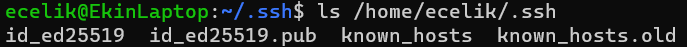
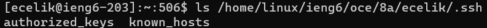

# Lab Report 2: Servers and SSH Keys
By Ekin Celik
## Part 1
Code:
```
import java.io.IOException;
import java.net.URI;

class Handler implements URLHandler 
{

    String myString = "";
    int n = 1;

    public String handleRequest(URI url) 
    {
     if (url.getPath().contains("/add-message")) 
     {
            String[] parameters = url.getQuery().split("=");
            if (parameters[0].equals("s")) 
            {
                myString+="\n";
                myString+=String.format("%d. ", n++);
                myString+=parameters[1];
                return myString;
            }
            else
            {
                return "404 Not Found!";
            }

     }
     else
     {
        return myString;
     }
    }
}

class StringServer {
    public static void main(String[] args) throws IOException {
        if(args.length == 0){
            System.out.println("Missing port number! Try any number between 1024 to 49151");
            return;
        }

        int port = Integer.parseInt(args[0]);

        Server.start(port, new Handler());
    }
}
```
Screenshots:
  
In this instance, the method that was called is handleRequest() which just takes an input of a URL. The relevant fields for this call are the string, as well as the counter for how many inputs we have made. Before this specific call, the string is empty, and the counter is 0. As handleRequest() runs, it not only returns the string in the argument, but also appends it to the string variable along with appropriate formatting, which, in this case, is just a "1. " and "\n".
  
Once again, the same method is called, and given just a URL as an argument. This time, the URL is different, but the logic works the same. The fields that are used are myString and n, which are the string and counter variables. Before the method runs, myString is just "1. Hello!\n", and n is 1. They are updated as such: myString gains a newline '\n', a number, a period, a space ("2. "), and the user input, while the counter, n, simply gets incremented by one, n now equals 2. For adding the new strings to myString, we  simply append myString by using the += operator, which, in java, does what we want.
## Part 2
Here is where my private keys are (Specifically, in the file called id_ed25519):  
  
And here is where my public keys are:  
  
Here is an example of me being able to login without a password by using these keys:  
  
(I keep getting these error messages, and I don't know what they mean. They don't appear to cause any problems.)  
## Part 3  
Something I learned in these weeks is how to develop the most basic web server. I understood what web servers were, but I didn't have a clue what it was like to develop and run one. It was also interesting to me how websites can be structured similarly to directories in a computer by looking at the url. In fact, using the url to change the values of variables in the server was strange to me at first, but now that I understand how to do it, it seems simple.


