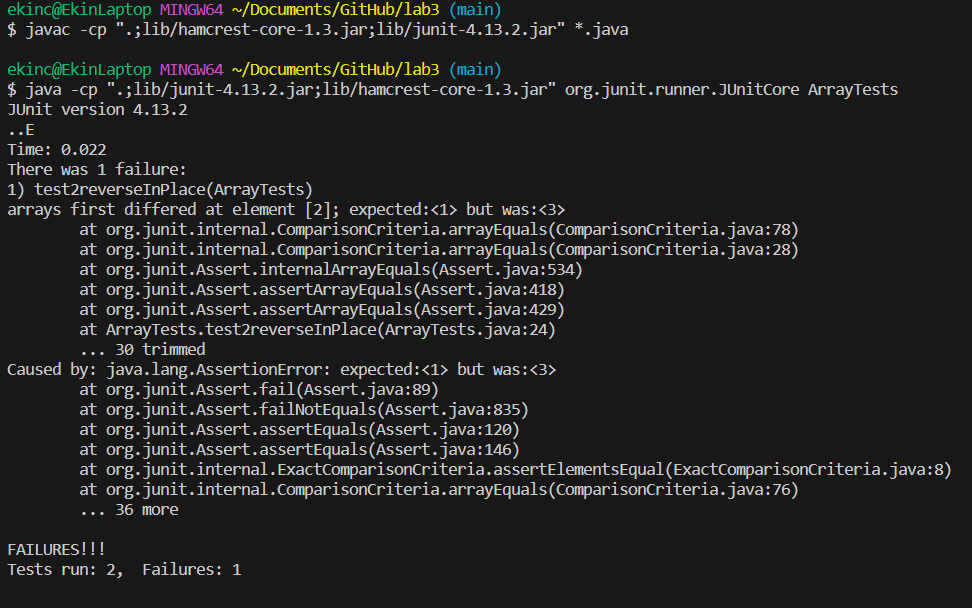
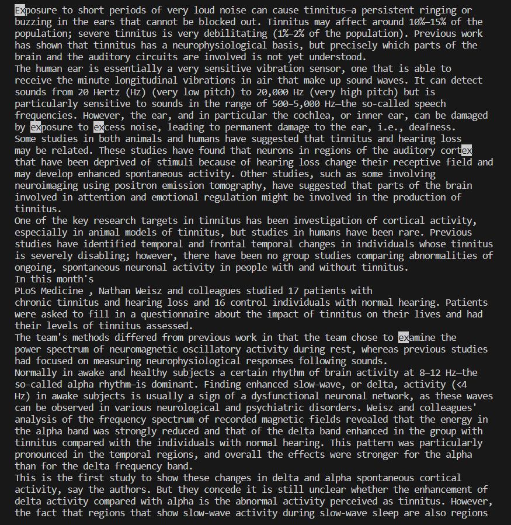

# Lab Report 3: Bugs and Commands
By Ekin Celik
## Part 1: Bugs in reverseInPlace()

A failure-inducing input for the buggy method: reverseInPlace():

```
@Test
  public void test2reverseInPlace() {
    int[] input1 = {1, 2, 3};
    ArrayExamples.reverseInPlace(input1);
    assertArrayEquals(new int[] {3, 2, 1}, input1);
  }
```

A non-failure-inducing input for method: reverseInPlace():
```
@Test 
	public void testReverseInPlace() {
    int[] input1 = { 3 };
    ArrayExamples.reverseInPlace(input1);
    assertArrayEquals(new int[]{ 3 }, input1);
	}
```
The symptom as shown by the output of running the tests:  

  

The BUGGY code:  
```
static void reverseInPlace(int[] arr) {
    for(int i = 0; i < arr.length; i += 1) {
      arr[i] = arr[arr.length - i - 1];
    }
  }
```  
The FIXED code:  
```
static void reverseInPlace(int[] arr) {
    for(int i = 0; i < (arr.length / 2); i += 1) {
      int temp = arr[i];
      arr[i] = arr[arr.length - i - 1];
      arr[arr.length - i - 1] = temp;
    }
  }
```

The problem with th BUGGY code is that it runs through every element in the array, and replaces it with the value of the mirrored element in the array. By mirrored, I mean the element that is the same distance from the end of the array as the the current element is from the front of the array.  
  
This is a problem because after we reach the halfway point of the array, we find that we have lost all the data in the first half of our array, and continuing our algorithm, we would be replacing the current element with itself, because the mirror of all the elements in the second half have already been replaced by the element itself. This bug does not deliver any symptoms if the test case only has one element, because the algorithm does not run, and the array is unchanged. However, as soon as we add more, and distinct, elements, we find the bug.  

In order to fix this bug, let's only run through half of the array, and instead of replacing values, let's *swap* values. We will swap every element in the first half with it's mirror, which will be in the second half. In order to swap, we must create a temporary variable that will store the value of the current element, so that we can remember it after we update the current element. Note that if our array has an odd count, our algorithm does nothing to the middle element, which is the correct behavior. After our algorithm ends, our new array will be reversed.

## Part 2: Researching Commands

Let's use the "less" command:  

**USING Option: -F:**  

On a short file:
```
ekinc@EkinLaptop MINGW64 ~/Documents/GitHub/docsearch (main)
$ less -F technical/plos/pmed.0020191.txt


        The excellent article by Jordan Paradise, Lori B. Andrews, and colleagues, “Ethics.
        Constructing Ethical Guidelines for Biohistory” [1], neither advocates nor argues against
        biohistorical research; instead, it points out that such investigations are currently
        taking place without guidelines—ethical, scientific, moral, or religious. The question
        remains: if such guidelines were to be established, what individuals, institutions,
        governments, medical examiners, family members, or intrepid biographers are to be given
        permission? Who is to decide what is “historically significant”? Not to mention the
        meta-question: who is to decide who is to decide? I apologize to the authors if my brief
        comments [2] implied that they took a position on this issue.


ekinc@EkinLaptop MINGW64 ~/Documents/GitHub/docsearch (main)
$
```
On a long file:  

This is the command.
```
ekinc@EkinLaptop MINGW64 ~/Documents/GitHub/docsearch (main)
$ less -F technical/plos/pmed.0020194.txt
```
Here is the terminal output.
```


        Exposure to short periods of very loud noise can cause tinnitus—a persistent ringing or
        buzzing in the ears that cannot be blocked out. Tinnitus may affect around 10%–15% of the
        population; severe tinnitus is very debilitating (1%–2% of the population). Previous work
        has shown that tinnitus has a neurophysiological basis, but precisely which parts of the
        brain and the auditory circuits are involved is not yet understood.
        The human ear is essentially a very sensitive vibration sensor, one that is able to
        receive the minute longitudinal vibrations in air that make up sound waves. It can detect
        sounds from 20 Hertz (Hz) (very low pitch) to 20,000 Hz (very high pitch) but is
        particularly sensitive to sounds in the range of 500–5,000 Hz—the so-called speech
        frequencies. However, the ear, and in particular the cochlea, or inner ear, can be damaged
        by exposure to excess noise, leading to permanent damage to the ear, i.e., deafness.
        Some studies in both animals and humans have suggested that tinnitus and hearing loss
        may be related. These studies have found that neurons in regions of the auditory cortex
        that have been deprived of stimuli because of hearing loss change their receptive field and
        may develop enhanced spontaneous activity. Other studies, such as some involving
        neuroimaging using positron emission tomography, have suggested that parts of the brain
        involved in attention and emotional regulation might be involved in the production of
        tinnitus.
        One of the key research targets in tinnitus has been investigation of cortical activity,
        especially in animal models of tinnitus, but studies in humans have been rare. Previous
        studies have identified temporal and frontal temporal changes in individuals whose tinnitus
        is severely disabling; however, there have been no group studies comparing abnormalities of
        ongoing, spontaneous neuronal activity in people with and without tinnitus.
        In this month's
        PLoS Medicine , Nathan Weisz and colleagues studied 17 patients with
        chronic tinnitus and hearing loss and 16 control individuals with normal hearing. Patients
        were asked to fill in a questionnaire about the impact of tinnitus on their lives and had
        their levels of tinnitus assessed.
        The team's methods differed from previous work in that the team chose to examine the
        power spectrum of neuromagnetic oscillatory activity during rest, whereas previous studies
        had focused on measuring neurophysiological responses following sounds.
        Normally in awake and healthy subjects a certain rhythm of brain activity at 8–12 Hz—the
        so-called alpha rhythm—is dominant. Finding enhanced slow-wave, or delta, activity (<4
        Hz) in awake subjects is usually a sign of a dysfunctional neuronal network, as these waves
        can be observed in various neurological and psychiatric disorders. Weisz and colleagues'
        analysis of the frequency spectrum of recorded magnetic fields revealed that the energy in
        the alpha band was strongly reduced and that of the delta band enhanced in the group with
        tinnitus compared with the individuals with normal hearing. This pattern was particularly
        pronounced in the temporal regions, and overall the effects were stronger for the alpha
```
Here is what I understand -F does:  
According to [phoenixnap](https://phoenixnap.com/kb/less-command-in-linux), the -F option exits the file viewer if the text is less than one page, and therefore fits on the screen. This is very convenient, because it means that you don't have to manually exit the viewer in the case that the text is short enough as to not require scrolling. If the text is longer than one page, less acts as normal, and allows standard use of the viewer.  

**USING Option -i:**

On first file:  
Command:
```
ekinc@EkinLaptop MINGW64 ~/Documents/GitHub/docsearch (main)
$ less -i technical/plos/pmed.0020194.txt
```
Terminal Output after I search for "ex": (note the lowercase e)  

  

On second file:
Command: 
```
ekinc@EkinLaptop MINGW64 ~/Documents/GitHub/docsearch (main)
$ less -i technical/plos/pmed.0020192.txt
```
Terminal output after I search for "I": (note the capital)

