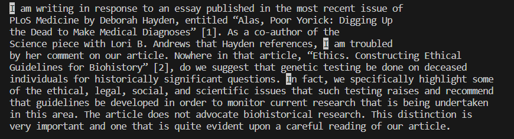

# Lab Report 3: Bugs and Commands
By Ekin Celik
## Part 1: Bugs in reverseInPlace()

A failure-inducing input for the buggy method: reverseInPlace():

```
@Test
  public void test2reverseInPlace() {
    int[] input1 = {1, 2, 3};
    ArrayExamples.reverseInPlace(input1);
    assertArrayEquals(new int[] {3, 2, 1}, input1);
  }
```

A non-failure-inducing input for method: reverseInPlace():
```
@Test 
	public void testReverseInPlace() {
    int[] input1 = { 3 };
    ArrayExamples.reverseInPlace(input1);
    assertArrayEquals(new int[]{ 3 }, input1);
	}
```
The symptom as shown by the output of running the tests:  

  

The BUGGY code:  
```
static void reverseInPlace(int[] arr) {
    for(int i = 0; i < arr.length; i += 1) {
      arr[i] = arr[arr.length - i - 1];
    }
  }
```  
The FIXED code:  
```
static void reverseInPlace(int[] arr) {
    for(int i = 0; i < (arr.length / 2); i += 1) {
      int temp = arr[i];
      arr[i] = arr[arr.length - i - 1];
      arr[arr.length - i - 1] = temp;
    }
  }
```

The problem with th BUGGY code is that it runs through every element in the array, and replaces it with the value of the mirrored element in the array. By mirrored, I mean the element that is the same distance from the end of the array as the the current element is from the front of the array.  
  
This is a problem because after we reach the halfway point of the array, we find that we have lost all the data in the first half of our array, and continuing our algorithm, we would be replacing the current element with itself, because the mirror of all the elements in the second half have already been replaced by the element itself. This bug does not deliver any symptoms if the test case only has one element, because the algorithm does not run, and the array is unchanged. However, as soon as we add more, and distinct, elements, we find the bug.  

In order to fix this bug, let's only run through half of the array, and instead of replacing values, let's *swap* values. We will swap every element in the first half with it's mirror, which will be in the second half. In order to swap, we must create a temporary variable that will store the value of the current element, so that we can remember it after we update the current element. Note that if our array has an odd count, our algorithm does nothing to the middle element, which is the correct behavior. After our algorithm ends, our new array will be reversed.

## Part 2: Researching Commands

Let's use the "less" command:  

**USING Option: -F:**  

On a short file:
```
ekinc@EkinLaptop MINGW64 ~/Documents/GitHub/docsearch (main)
$ less -F technical/plos/pmed.0020191.txt


        The excellent article by Jordan Paradise, Lori B. Andrews, and colleagues, “Ethics.
        Constructing Ethical Guidelines for Biohistory” [1], neither advocates nor argues against
        biohistorical research; instead, it points out that such investigations are currently
        taking place without guidelines—ethical, scientific, moral, or religious. The question
        remains: if such guidelines were to be established, what individuals, institutions,
        governments, medical examiners, family members, or intrepid biographers are to be given
        permission? Who is to decide what is “historically significant”? Not to mention the
        meta-question: who is to decide who is to decide? I apologize to the authors if my brief
        comments [2] implied that they took a position on this issue.


ekinc@EkinLaptop MINGW64 ~/Documents/GitHub/docsearch (main)
$
```
On a long file:  

This is the command.
```
ekinc@EkinLaptop MINGW64 ~/Documents/GitHub/docsearch (main)
$ less -F technical/plos/pmed.0020194.txt
```
Here is the terminal output.
```


        Exposure to short periods of very loud noise can cause tinnitus—a persistent ringing or
        buzzing in the ears that cannot be blocked out. Tinnitus may affect around 10%–15% of the
        population; severe tinnitus is very debilitating (1%–2% of the population). Previous work
        has shown that tinnitus has a neurophysiological basis, but precisely which parts of the
        brain and the auditory circuits are involved is not yet understood.
        The human ear is essentially a very sensitive vibration sensor, one that is able to
        receive the minute longitudinal vibrations in air that make up sound waves. It can detect
        sounds from 20 Hertz (Hz) (very low pitch) to 20,000 Hz (very high pitch) but is
        particularly sensitive to sounds in the range of 500–5,000 Hz—the so-called speech
        frequencies. However, the ear, and in particular the cochlea, or inner ear, can be damaged
        by exposure to excess noise, leading to permanent damage to the ear, i.e., deafness.
        Some studies in both animals and humans have suggested that tinnitus and hearing loss
        may be related. These studies have found that neurons in regions of the auditory cortex
        that have been deprived of stimuli because of hearing loss change their receptive field and
        may develop enhanced spontaneous activity. Other studies, such as some involving
        neuroimaging using positron emission tomography, have suggested that parts of the brain
        involved in attention and emotional regulation might be involved in the production of
        tinnitus.
        One of the key research targets in tinnitus has been investigation of cortical activity,
        especially in animal models of tinnitus, but studies in humans have been rare. Previous
        studies have identified temporal and frontal temporal changes in individuals whose tinnitus
        is severely disabling; however, there have been no group studies comparing abnormalities of
        ongoing, spontaneous neuronal activity in people with and without tinnitus.
        In this month's
        PLoS Medicine , Nathan Weisz and colleagues studied 17 patients with
        chronic tinnitus and hearing loss and 16 control individuals with normal hearing. Patients
        were asked to fill in a questionnaire about the impact of tinnitus on their lives and had
        their levels of tinnitus assessed.
        The team's methods differed from previous work in that the team chose to examine the
        power spectrum of neuromagnetic oscillatory activity during rest, whereas previous studies
        had focused on measuring neurophysiological responses following sounds.
        Normally in awake and healthy subjects a certain rhythm of brain activity at 8–12 Hz—the
        so-called alpha rhythm—is dominant. Finding enhanced slow-wave, or delta, activity (<4
        Hz) in awake subjects is usually a sign of a dysfunctional neuronal network, as these waves
        can be observed in various neurological and psychiatric disorders. Weisz and colleagues'
        analysis of the frequency spectrum of recorded magnetic fields revealed that the energy in
        the alpha band was strongly reduced and that of the delta band enhanced in the group with
        tinnitus compared with the individuals with normal hearing. This pattern was particularly
        pronounced in the temporal regions, and overall the effects were stronger for the alpha
```
Here is what I understand -F does:  
According to [phoenixnap](https://phoenixnap.com/kb/less-command-in-linux), the -F option exits the file viewer if the text is less than one page, and therefore fits on the screen. This is very convenient, because it means that you don't have to manually exit the viewer in the case that the text is short enough as to not require scrolling. If the text is longer than one page, less acts as normal, and allows standard use of the viewer.  

**USING Option -i:**

On first file:  
Command:
```
ekinc@EkinLaptop MINGW64 ~/Documents/GitHub/docsearch (main)
$ less -i technical/plos/pmed.0020194.txt
```
Terminal Output after I search for "ex": (note the lowercase e)  

  

On second file:
Command: 
```
ekinc@EkinLaptop MINGW64 ~/Documents/GitHub/docsearch (main)
$ less -i technical/plos/pmed.0020192.txt
```
Terminal output after I search for "I": (note the capital)  
  

Also according to [phoenixnap](https://phoenixnap.com/kb/less-command-in-linux), the -i option makes the search functionality ignore the case of characters. However, this appears to be only somehat true. What I found is that it only ignores the case of lowercase letters in the search. Meaning, if I search "i", it will highlight all "i" and "I", but if I search "I", it will only highlight "I". I think this logic is not very convenient, and it would be more convenient if it acutally ignored case sensitivity.  

**USING Option -N:**

On first file:  

Command: 
```
ekinc@EkinLaptop MINGW64 ~/Documents/GitHub/docsearch (main)
$ less -N technical/plos/pmed.0020194.txt
```
Output:
```
      1
      2
      3
      4
      5
      6         Exposure to short periods of very loud noise can cause tinnitus—a persistent ringing or
      7         buzzing in the ears that cannot be blocked out. Tinnitus may affect around 10%–15% of the
      8         population; severe tinnitus is very debilitating (1%–2% of the population). Previous work
      9         has shown that tinnitus has a neurophysiological basis, but precisely which parts of the
     10         brain and the auditory circuits are involved is not yet understood.
     11         The human ear is essentially a very sensitive vibration sensor, one that is able to
     12         receive the minute longitudinal vibrations in air that make up sound waves. It can detect
     13         sounds from 20 Hertz (Hz) (very low pitch) to 20,000 Hz (very high pitch) but is
     14         particularly sensitive to sounds in the range of 500–5,000 Hz—the so-called speech
     15         frequencies. However, the ear, and in particular the cochlea, or inner ear, can be damaged
     16         by exposure to excess noise, leading to permanent damage to the ear, i.e., deafness.
     17         Some studies in both animals and humans have suggested that tinnitus and hearing loss
     18         may be related. These studies have found that neurons in regions of the auditory cortex
     19         that have been deprived of stimuli because of hearing loss change their receptive field and
     20         may develop enhanced spontaneous activity. Other studies, such as some involving
     21         neuroimaging using positron emission tomography, have suggested that parts of the brain
     22         involved in attention and emotional regulation might be involved in the production of
     23         tinnitus.
     24         One of the key research targets in tinnitus has been investigation of cortical activity,
     25         especially in animal models of tinnitus, but studies in humans have been rare. Previous
     26         studies have identified temporal and frontal temporal changes in individuals whose tinnitus
     27         is severely disabling; however, there have been no group studies comparing abnormalities of
     28         ongoing, spontaneous neuronal activity in people with and without tinnitus.
     29         In this month's
     30         PLoS Medicine , Nathan Weisz and colleagues studied 17 patients with
     31         chronic tinnitus and hearing loss and 16 control individuals with normal hearing. Patients
     32         were asked to fill in a questionnaire about the impact of tinnitus on their lives and had
     33         their levels of tinnitus assessed.
     34         The team's methods differed from previous work in that the team chose to examine the
     35         power spectrum of neuromagnetic oscillatory activity during rest, whereas previous studies
     36         had focused on measuring neurophysiological responses following sounds.
     37         Normally in awake and healthy subjects a certain rhythm of brain activity at 8–12 Hz—the
     38         so-called alpha rhythm—is dominant. Finding enhanced slow-wave, or delta, activity (<4
     39         Hz) in awake subjects is usually a sign of a dysfunctional neuronal network, as these waves
     40         can be observed in various neurological and psychiatric disorders. Weisz and colleagues'
     41         analysis of the frequency spectrum of recorded magnetic fields revealed that the energy in
     42         the alpha band was strongly reduced and that of the delta band enhanced in the group with
     43         tinnitus compared with the individuals with normal hearing. This pattern was particularly
     44         pronounced in the temporal regions, and overall the effects were stronger for the alpha
```

On second file:  

Command:
```
ekinc@EkinLaptop MINGW64 ~/Documents/GitHub/docsearch (main)
$ less -N technical/plos/pmed.0020198.txt
```
Output: (After scrolling to the end)
```
     17         increased levels of inflammatory markers, such as C-reactive protein and white blood cell
     18         count. Several studies have shown that such markers predict future cardiovascular events.
     19         Markers such as C-reactive protein are also increasingly implicated in the pathogenesis of
     20         atherosclerosis. There are, however, still some gaps in our knowledge of cardiovascular
     21         disease, smoking, and the predictive use of such markers. For example, few studies have
     22         examined the impact of smoking cessation on levels of inflammatory markers or on
     23         cardiovascular risk reduction; the level and rate at which the inflammatory response
     24         subsides following smoking cessation is also uncertain. Furthermore, whether traditional
     25         risk factors can explain the decline in cardiovascular risk following smoking cessation is
     26         also unclear.
     27         In this month's
     28         PLoS Medicine , Arvind Bakhru and Thomas Erlinger investigate the
     29         association between smoking and smoking cessation and levels of inflammatory markers and
     30         cardiovascular risk factors. Data were gathered on 15,489 US adults between 1988 and 1994
     31         in the Third National Health and Nutrition Examination Survey. Of these, 7,665 were
     32         classified as never smokers, 3,459 were former smokers, and 4,365 were current smokers.
     33         The investigators focused on changes in C-reactive protein, white blood cell count,
     34         albumin, and fibrinogen, and the traditional risk factors—total cholesterol, high-density
     35         lipoprotein cholesterol, triglycerides, systolic blood pressure, and diabetes—that occurred
     36         with decreased smoking intensity and increased time since smoking cessation. They found
     37         that inflammatory markers had a dose-dependent and temporal relationship to smoking and
     38         smoking cessation. They noted that both inflammatory and traditional risk factors improved
     39         with less smoking, but as the time since smokers quit increased, inflammatory markers
     40         resolved more slowly than traditional cardiovascular risk factors. Still, the
     41         smoking-associated inflammatory response returned to normal within five years after smokers
     42         quit, suggesting that the vascular effects were reversible and that cardiovascular risk
     43         subsides gradually with reduced exposure.
     44         The authors conclude that these findings support the hypothesis that cardiovascular risk
     45         falls as inflammatory response falls, and that inflammatory markers are good indicators of
     46         this risk reduction. Despite limitations of the study, including possible errors from
     47         self-reporting and lack of data on second-hand smoke and newer measures such as
     48         interleukin-6 and high-sensitivity C-reactive protein, the inflammatory markers studied
     49         here demonstrated a much clearer trend and longer-lasting effect after smoking cessation
     50         than traditional risk factors, and hence were more useful and accurate markers of
     51         disease.
     52         As with related studies, these results suggest that smoking cessation should be a more
     53         prominent goal of public policy, and the authors conclude that policymakers must pursue
     54         smoking cessation plans as an opportunity to make savings on health care through
     55         cardiovascular risk reduction. Further research should explore the acute phase response in
     56         the months after smoking cessation, which this and other studies have not been able to
     57         study adequately.
     58
     59
     60
(END)
```

The -N option is very useful. I found it on [phoenixnap](https://phoenixnap.com/kb/less-command-in-linux) as well, and all it does is display line numbers on each line. This is extremely convenient as it allows the viewer of a file to have a sense of size of a file, especialy when it is not so intuitive to scroll through it. As expected, the line numbers move with the text, so, even after we scroll to the bottom of the viewer, we can still see the numbers until we reach EOF.  

**USING Option: -:**  

On first file:  

Command:
```
ekinc@EkinLaptop MINGW64 ~/Documents/GitHub/docsearch (main)
$ less -X technical/plos/pmed.0020198.txt
```
Output: (After exiting viewer)
```

        Smoking is the single largest preventable cause of disease and premature death,
        according to the World Health Organization. Smoking-related diseases kill one in ten adults
        globally, i.e., 4 million deaths annually; by 2030, if current trends continue, smoking
        will kill one in six people. Smoking is a prime factor in heart disease, stroke, and
        chronic lung disease, which cost the United States more than $150 billion a year. The
        relationship between smoking and cardiovascular disease is well documented, as is the
        association of smoking with increased levels of inflammatory markers and accelerated
        atherosclerosis. It is also well known that when smokers quit, their risk of mortality and
        future cardiac events declines, but there is little data quantifying the rate of this risk
        reduction.
        Smoking triggers an immunologic response to vascular injury, which is associated with
        increased levels of inflammatory markers, such as C-reactive protein and white blood cell
        count. Several studies have shown that such markers predict future cardiovascular events.
        Markers such as C-reactive protein are also increasingly implicated in the pathogenesis of
        atherosclerosis. There are, however, still some gaps in our knowledge of cardiovascular
        disease, smoking, and the predictive use of such markers. For example, few studies have
        examined the impact of smoking cessation on levels of inflammatory markers or on
        cardiovascular risk reduction; the level and rate at which the inflammatory response
        subsides following smoking cessation is also uncertain. Furthermore, whether traditional
        risk factors can explain the decline in cardiovascular risk following smoking cessation is
        also unclear.
        In this month's
        PLoS Medicine , Arvind Bakhru and Thomas Erlinger investigate the
        association between smoking and smoking cessation and levels of inflammatory markers and
        cardiovascular risk factors. Data were gathered on 15,489 US adults between 1988 and 1994
        in the Third National Health and Nutrition Examination Survey. Of these, 7,665 were
        classified as never smokers, 3,459 were former smokers, and 4,365 were current smokers.
        The investigators focused on changes in C-reactive protein, white blood cell count,
        albumin, and fibrinogen, and the traditional risk factors—total cholesterol, high-density
        lipoprotein cholesterol, triglycerides, systolic blood pressure, and diabetes—that occurred
        with decreased smoking intensity and increased time since smoking cessation. They found
        that inflammatory markers had a dose-dependent and temporal relationship to smoking and
        smoking cessation. They noted that both inflammatory and traditional risk factors improved
        with less smoking, but as the time since smokers quit increased, inflammatory markers
        resolved more slowly than traditional cardiovascular risk factors. Still, the
        smoking-associated inflammatory response returned to normal within five years after smokers
        quit, suggesting that the vascular effects were reversible and that cardiovascular risk
        subsides gradually with reduced exposure.
        The authors conclude that these findings support the hypothesis that cardiovascular risk

ekinc@EkinLaptop MINGW64 ~/Documents/GitHub/docsearch (main)
$
```

On second file:  

Command:
```
ekinc@EkinLaptop MINGW64 ~/Documents/GitHub/docsearch (main)
$ less -X technical/plos/pmed.0010024.txt
```

Output: (After quitting less viewer)
```
        Acidosis is a major cause of death in patients with malaria, although what causes
        acidosis is still unclear. One possibility is that hypovolemia contributes to the problem,
        and that rehydration therapy could be of benefit. Now, Sanjeev Krishna and colleagues have
        shown that in children with severe malaria dehydration is not severe and is not correlated
        with other measures of disease severity. “The optimum resuscitation approach in severe
        childhood malaria remains to be defined,” says Nick White (Mahidol University, Thailand),
        the academic editor of the paper. “The relative advantages of blood, colloids, and
        crystalloids need to be characterized.”
        Every year around 200 million people worldwide contract malaria, of whom over a million
        die. The vast majority of those who die are children under five years, mostly in Africa,
        since young children have had little chance to acquire any immunity. Fluid resuscitation is
        generally considered to be a cornerstone of treatment—but how much fluid should be given?
        Some researchers believe that surrogate signs of fluid depletion—such as tachycardia,
        reduced capillary refill time, and reduced urine excretion—suggest that there is
        substantial volume depletion. The reason that the amount of fluid given matters so much is
        that giving too much, especially of hypotonic solutions, can lead to electrolyte imbalance,
        especially hyponatremia and hypokalemia.
        Research efforts have been hampered by not having an easy way to assess in patients the
        fluid depletion in different compartments of the body, i.e., total body water and
        extracellular and intracellular water volume. Krishna and colleagues used heavy-water
        distribution to calculate the total body water and bromide distribution to determine the
        extracellular volume in 19 children with moderately severe malaria and 16 with severe
        malaria in Gabon. By subtracting extracellular volume from total body water, they were able
        to calculate intracellular volume for each child. They also used a less invasive and more
        rapid method of determining water volumes based on using bioelectrical impedance to
        calculate the volume.
        None of the children were severely dehydrated (defined as more than 100 ml/kg
        depletion), and only three of the children with severe anemia had fluid depletion, which
        was moderate (60–90 ml/kg depletion). “This challenges the view that dehydration is a major
        contributor to the pathology of this frequently lethal disease,” says White.
        So based on these data, obtained from a carefully studied, albeit small group of
        children, what should people who treat children with malaria do? The authors' first
        recommendation is that clinicians should think again about how vigorously they rehydrate
        children, and if they have access to ways of assessing fluid volume more precisely, they
        should do so (not a trivial undertaking in many hospitals where these children are
        treated). And certainly the methods used by Krishna and colleagues should undergo wider
        testing in larger groups of children to confirm their usefulness. Until the worldwide
        efforts to prevent malaria come to fruition, refining the management of infected children
        will remain a cornerstone of the efforts against this devastating disease.


ekinc@EkinLaptop MINGW64 ~/Documents/GitHub/docsearch (main)
$
```

I can see some scenarios in which case the -X option would be useful or convenient. I learned this from [phoenixnap](https://phoenixnap.com/kb/less-command-in-linux). The option makes less not clear the terminal after quitting, which means that the last viewed screen from less is left on the terminal. I could imagine this being useful if you needed or wanted to see what you were last looking at while typing new terminal commands. For example, perhaps the file you were viewing was a guide on what commands to run to accomplish a certain task. Instead of having to remember what to run, or having to run less again, you could just leave the last output on the screen. This is better than using cat, because with less, you could scross to just the section you want, instead of having to leave the entire file on your screen.
