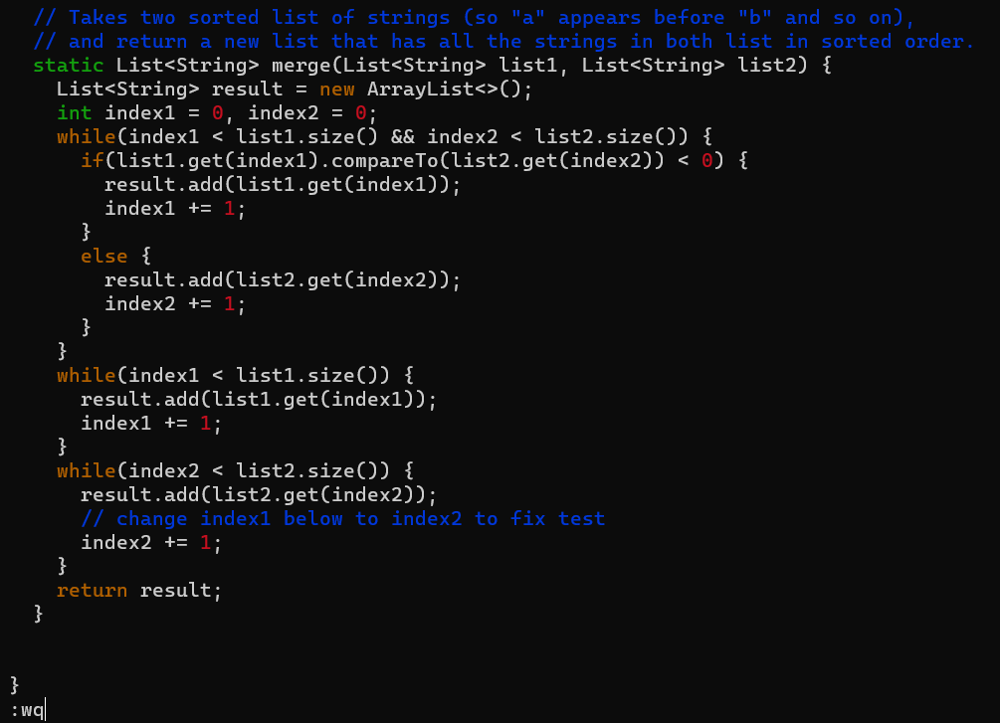

# Lab Report 4: GIT/VIM
By Ekin Celik
## LOGIN
```
ecelik@EkinLaptop:~$ ssh ecelik@ieng6.ucsd.edu
Last login: Sun Nov 19 16:26:04 2023 from 128.54.195.69
quota: Cannot resolve mountpoint path /home/linux/staff/.snapshot/hourly.2023-10-03_0801: Stale file handle
quota: Cannot resolve mountpoint path /home/linux/dsmlp/.snapshot/daily.2023-10-12_0010: Stale file handle
quota: Cannot resolve mountpoint path /home/linux/dsmlp/.snapshot/daily.2023-11-04_0010: Stale file handle
quota: Cannot resolve mountpoint path /home/linux/dsmlp/.snapshot/weekly.2023-10-15_0015: Stale file handle
quota: Cannot resolve mountpoint path /home/linux/dsmlp/.snapshot/daily.2023-10-25_0010: Stale file handle
Hello ecelik, you are currently logged into ieng6-201.ucsd.edu

You are using 0% CPU on this system

Cluster Status
Hostname     Time    #Users  Load  Averages
ieng6-201   16:30:01   17  22.14,  22.21,  22.03
ieng6-202   16:30:01   18  1.05,   1.12,   1.23
ieng6-203   16:30:01   15  4.17,   4.32,   4.27


To begin work for one of your courses [ cs30fa23 ], type its name
at the command prompt.  (For example, "cs30fa23", without the quotes).

To see all available software packages, type "prep -l" at the command prompt,
or "prep -h" for more options.
Reminder to do all CSE 30 related stuff on pi-cluster!
[ecelik@ieng6-201]:~:501$
```
```
<up><enter>
```
Since my last command from my local machine was logging into ieng6, I can simpply run it again with these keystrokes. 

## CLONING THE FORK
```
[ecelik@ieng6-201]:~:501$ git clone git@github.com:e-celik/lab7.git
Cloning into 'lab7'...
remote: Enumerating objects: 58, done.
remote: Counting objects: 100% (24/24), done.
remote: Compressing objects: 100% (12/12), done.
remote: Total 58 (delta 15), reused 12 (delta 12), pack-reused 34
Receiving objects: 100% (58/58), 376.37 KiB | 1.40 MiB/s, done.
Resolving deltas: 100% (21/21), done.
[ecelik@ieng6-201]:~:502$
```
```
git clone <ctrl+v><enter>
```
I have the github ssh url in my clipboard, to allow me to quickly clone the repo without having to type it out. 

## RUNNING TESTS
```
[ecelik@ieng6-201]:~:502$ cd lab7/
[ecelik@ieng6-201]:lab7:503$ bash test.sh
JUnit version 4.13.2
..E
Time: 0.868
There was 1 failure:
1) testMerge2(ListExamplesTests)
org.junit.runners.model.TestTimedOutException: test timed out after 500 milliseconds
        at java.util.Arrays.copyOf(Arrays.java:3210)
        at java.util.Arrays.copyOf(Arrays.java:3181)
        at java.util.ArrayList.grow(ArrayList.java:267)
        at java.util.ArrayList.ensureExplicitCapacity(ArrayList.java:241)
        at java.util.ArrayList.ensureCapacityInternal(ArrayList.java:233)
        at java.util.ArrayList.add(ArrayList.java:464)
        at ListExamples.merge(ListExamples.java:42)
        at ListExamplesTests.testMerge2(ListExamplesTests.java:19)

FAILURES!!!
Tests run: 2,  Failures: 1

[ecelik@ieng6-201]:lab7:504$
```
```
cd l<tab><enter>
bash test.sh
```
First I type cd. Then, since I only have one directory in ~ that starts with "l," I can use the tab key to autocomplete the path to lab7. Next, I can type the bash command to run the tests. 

## EDIT CODE
```
[ecelik@ieng6-201]:lab7:504$ vim ListExamples.java
```
Screenshot from vim just before pressing enter on the command :wq

```
vim L<tab>.<tab><enter>
:44<enter>ea<backspace>2<esc>:wq<enter>
```
To enter vim, I can type vim, then capital L, then tab to autocomplete to ListExamples. However, since there are two files that start with "ListExamples," I have to enter another character that will specify which file to use. So, I press "." and then tab again to autocomplete. Next, I must go to line 44, where the error is. I do this by typing a colon followed by the line number, and pressing enter. Then, I skip to the last character of the word with "e", and enter editing mode after the cursor with "a". Finally, I delete the erroneous 1 and replace it with 2. I press escape to exit editing mode, and type :wq in order to write the file and quit vim. 

## RERUN TESTS
```
[ecelik@ieng6-201]:lab7:505$ bash test.sh
JUnit version 4.13.2
..
Time: 0.09

OK (2 tests)

[ecelik@ieng6-201]:lab7:506$
```
```
<up><up><enter>
```
To run the tests again, I can just find the command in history by pressing uptick twice, then run it by presing enter. 

## GIT ADD/COMMIT/PUSH
```
[ecelik@ieng6-201]:lab7:509$ git add ListExamples.java
[ecelik@ieng6-201]:lab7:510$ git commit
[main b9d3ed7] fixed
 Committer: Ekin Celik <ecelik@ieng6-201.ucsd.edu>
Your name and email address were configured automatically based
on your username and hostname. Please check that they are accurate.
You can suppress this message by setting them explicitly. Run the
following command and follow the instructions in your editor to edit
your configuration file:

    git config --global --edit

After doing this, you may fix the identity used for this commit with:

    git commit --amend --reset-author

 1 file changed, 1 insertion(+), 1 deletion(-)
[ecelik@ieng6-201]:lab7:511$ git push
Enumerating objects: 5, done.
Counting objects: 100% (5/5), done.
Delta compression using up to 8 threads
Compressing objects: 100% (3/3), done.
Writing objects: 100% (3/3), 287 bytes | 287.00 KiB/s, done.
Total 3 (delta 2), reused 0 (delta 0), pack-reused 0
remote: Resolving deltas: 100% (2/2), completed with 2 local objects.
To github.com:e-celik/lab7.git
   327ab1a..b9d3ed7  main -> main
[ecelik@ieng6-201]:lab7:512$
```
```
git add L<tab><enter>
git commit<enter>
ifixed<esc>:wq<enter>
git push
```
First I must add the file to the commit by using git add. I type "L" and press tab and the file has been autocompleted, so I press enter. Next, I use git commit, which opens vim. In vim, I enter editing mode with "i", and I typed "fixed" as my message. Then, I exit vim by pressing escape, typing :wq, and pressing enter. Finally, I must push the commit by using the command git push.
